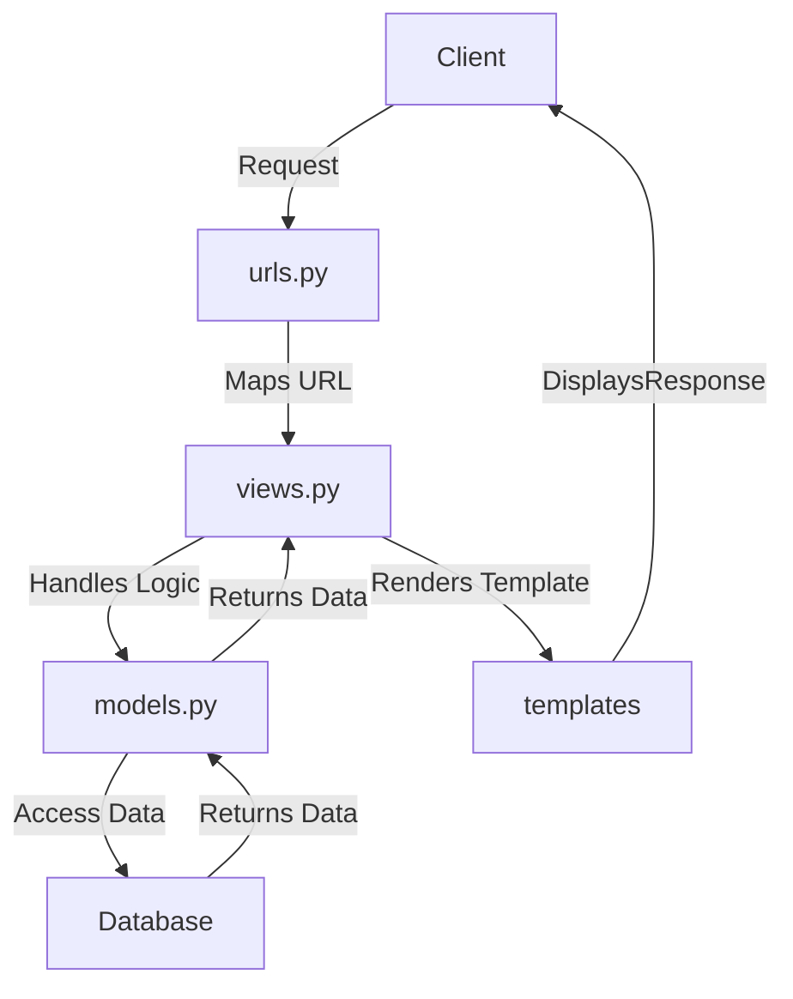

# README - PacilBay

## *Link* Aplikasi yang Sudah Dideploy
[Aplikasi PacilBay](http://theo-ananda-pacilbay.pbp.cs.ui.ac.id/) (http://theo-ananda-pacilbay.pbp.cs.ui.ac.id/)

<details>
  <summary><h2>Tugas 2: Implementasi Model-View-Template (MVT) pada Django (Click to Expand)</h2></summary>

### Langkah-langkah Implementasi Aplikasi Berbasis Django

1. **Menyiapkan *development environment*:**
   - Menginstal Python, Django, dan *dependencies* yang dibutuhkan.
   - Membuat *virtual environment* supaya aplikasi tidak bentrok dengan versi lain.

2. **Membuat Proyek Django:**
   - Menjalankan `django-admin startproject pacilbay` untuk membuat proyek baru.
   - Menyesuaikan pengaturan di `settings.py`, seperti konfigurasi *database*, `INSTALLED_APPS`, *allowed host* untuk mengizinkan `localhost` dan PWS mengakses aplikasi.

3. **Membuat Aplikasi Django:**
   - Menjalankan `python manage.py startapp main` untuk membuat aplikasi `main` di dalam proyek.
   - Menambahkan aplikasi *main* ke dalam `INSTALLED_APPS` di `settings.py`.

4. **Membuat *Template* HTML:**
   - Membuat *HTML file* di folder `templates` untuk mengatur *view frontend*.
   - Menggunakan *template variables* untuk menampilkan nilai dari variabel yang akan dibuat di `views.py`.

5. **Membuat Model (`models.py`):**
   - Merancang model data dengan membuat *field* pada model di `models.py`.
   - Menjalankan perintah `python manage.py makemigrations` dan `python manage.py migrate` untuk merefleksikan perubahan model ke *database*.

6. **Membuat Views (`views.py`):**
   - Mengimpor fungsi render dari `django.shortcuts` dan menambhakan fungsi `show_main` yang berisi *dictionary* data untuk dikirimkan ke *HTML file*.
   - Menghubungkan views dengan *template HTML* yang akan dirender.

7. **Mengatur *URL Routing* (`urls.py`):**
   - Mengatur *routing *URL** di `urls.py` untuk menambahkan *path* ke aplikasi *main*.
   - Memastikan setiap *view* memiliki *URL *pattern** yang sesuai.

8. **Melakukan *Deployment*:**
    - Membuat proyek baru di *Pacil Web services* (PWS).
    - Mengonfigurasi `settings.py` untuk menambahkan *URL deployment* PWS ke `ALLOWED_HOSTS`.
    - Melakukan *add, commit*, dan *push* ke PWS.

### Bagan *Request* *Client* ke Web Aplikasi Django


**Penjelasan Bagan:**
    - `urls.py`: Menghubungkan *URL* yang diminta ke aplikasi dan data yang tersedia di views.py.
   - `views.py`: Menampung *template variables* untuk menampilkan nilai dari variabel yang sudah dibuat dalam `context`, dan akan di-*render* di halaman HTML.
   - `models.py`: Berisi model data dan menghubungkan ke *database*. `models.py` digunakan oleh `views.py` untuk mengambil dan mengolah data dari variabel yang sudah dibuat.
   - *Template* (HTML): Mengatur tampilan halaman web. *HTML file* akan di-*render* oleh `views.py` dan dikirim sebagai respons ke *client*.

### Fungsi **Git** dalam Pengembangan Perangkat Lunak
Git adalah *control version software* untuk mengelola dan melacak perubahan dalam *source code* selama pengembangan *software*. Fungsi utama git:

1. sebagai ***control version*** yang melacak setiap perubahan yang dibuat di dalam *source code* sehingga *developer* bisa kembali ke versi sebelumnya;
2. sebagai **sarana kolaborasi** karena memungkinkan beberapa *developer* bekerja di berbagai fitur atau memperbaiki bug tanpa mengganggu pekerjaan *developer* lain melalui *branch*.
3. sebagai ***development environment*** melalui *branching* dan *merging* sehingga *developer* bisa membuat cabang untuk pengembangan fitur atau *bug fixing* kemudian menggabungkannya ke *main branch* setelah dites.
4. menjaga **keamanan dan *backup*** karena bisa menyimpan *history* di *remote repository* seperti GitHub, GitLab, dll sehingga mengurangi risiko kode hilang.

### Alasan Menggunakan Django sebagai *Framework* Awal dalam Pembelajaran
1. **Framework Lengkap**
      Django adalah *full-stack *framework** yang menyediakan semua yang dibutuhkan *developer* seperti *Object-Relational Mapping* (ORM), *template engine*, *form handling*, dan *routing*.
2. **Arsitektur MTV (Model-Template-View)**
      Arsitektur *Model-Template-View* (MTV) memudahkan *developer* memahami arsitektur aplikasi web.
3. **Keamanan Terjaga**
      Django menyediakan *middleware* yang otomatis melindungi aplikasi dari *Cross-Site *Request* Forgery* (CSRF) dan juga memiliki mekanisme untuk mencegah *Cross-Site Scripting* (XSS) dengan secara otomatis meng-*escape* output HTML.
4. **Community Support**
      Django memiliki *komunitas* yang besar dan dokumentasi yang lengkap sehingga *beginner friendly :D*

### Mengapa Model pada Django Disebut sebagai ORM?

Model pada *Django disebut sebagai* ORM (*Object-Relational Mapping*) karena terdapat *interface* antara model di Python (class) dengan *relational *database** (tabel). Dengan prinsip ini, *developer* bisa bekerja menggunakan *database* dengan konsep *object-oriented* tanpa harus membuat query SQL manual. Django ORM mengubah operasi *Create, Read, Update, Delete* (CRUD) di OOP Python ke *query SQL* yang bersifat *connected* dengan *database*, sehingga memudahkan interaksi aplikasi dengan data.
</details>

<details>
  <summary><h2>Tugas 3: Implementasi Form dan Data Delivery pada Django (Click to Expand)</h2></summary>

### Langkah-langkah Implementasi Form dan Data Delivery pada Django
1. **Membuat Kerangka *Views* dengan Skeleton**
   Saya membuat kerangka *views* (skeleton) supaya desain web konsisten dan mengurangi *redundant code*. 
   - Buat direktori `templates` di folder utama, buat file `base.html` sebagai kerangka yang akan dipakai untuk semua halaman web di aplikasi-aplikasi lain.
   - Isi `base.html` dengan sintaks HTML dan *Django *template* tags* `` dan `` untuk bagian-bagian yang bisa diubah oleh *template* turunan di aplikasi-aplikasi lain.
   - Buka `settings.py`, tambahkan direktori `templates` (`'DIRS': [BASE_DIR / 'templates']`) ke dalam variabel `TEMPLATES` supaya *template* yg sudah dibuat dikenali Django.
2. **Mengubah *Primary Key* dari *Integer* Menjadi UUID**
   Untuk meningkatkan keamanan aplikasi, kita ubah *primary key* di model dari tipe data *integer* menjadi UUID (*Universally Unique Identifier*).
   - Pada `models.py` di aplikasi `main`, impor modul `uuid` dan ubah *primary key* menjadi UUIDField.
   - Menjalankan `makemigrations` dan `migrate` supaya perubahan yang kita lakukan disimpen di *database*.
3. **Membuat *Form Input Data***
   - Buat *file* `forms.py` di direktori *main*, dan buat `ModelForm` untuk model `ProductEntry`.
   - Buat *field* yang akan digunakan dalam *form* seperti `product_name`, `price`, `product_description`, dan `available_qty`.
   - Di `views.py`, buat fungsi `create_mood_entry` untuk menampilkan *form* dan menyimpan data baru saat *form* di-*submit* dan mereturn respons html ke *template* `create_product_entry`.
   - Validasi *form* menggunakan *function* `form.is_valid()` dan simpan data dengan *function* `form.save()`.
4. **Menampilkan Data di Halaman Web**
   - Ambil semua objek dari model `ProductEntry` dengan menambahkan *function* `ProductEntry.objects.all()` dan kirim ke *template* melalui *context* yang sudah dibuat sebelumnya. --> *function* ini akan di-*return* dengan html di *template* `main`.
   - Pada `main.html`, kita gunakan *looping* `` untuk menampilkan data dalam bentuk tabel. 
   - Pada `main.html`, kita tambahkan juga tombol untuk mengakses halaman *form input* data baru.
5. **Mengembalikan Data dalam Bentuk XML dan JSON (dan berdasarkan ID)**
   - Di `views.py`, buat fungsi `show_xml` untuk mengambil semua data dari model `MoodEntry`
   - Gunakan *serializers* Django untuk mengubah data menjadi format XML.
   - Buat juga buat versi jsonnya :)
   - Buat fungsi `show_xml_by_id` dan `show_json_by_id` di views.py untuk *mereturn* data berdasarkan id yang sudah difilter sebagai parameter. --> variabel data diubah dari *all* menjadi `ProductEntry.objects.filter(pk=id)`
6. **Menambahkan *URL *Pattern*s***
   - Tambahkan *path* untuk setiap fungsi *view* baru di variabel `urlpatterns` supaya bisa diakses di browser.
   - Mengecek apakah data bisa diambil dengan benar menggunakan *postman* (screenshoot terlampir di bawah)
Setelah melalui 6 langkah ini, kita bisa membuat form, menyimpan data, menampilkan data, dan *mereturn* data dalam format XML atau JSON di Django

### Mengapa kita memerlukan data delivery dalam pengimplementasian sebuah *platform*?
- Memungkinkan kita berinteraksi secara *real time* dengan *platform*
   Dengan menggunakan *data delivery*, kita bisa mengisi *form*, mengklik tombol, dan melakukan *search*. Data yang di-*input* dalam kegiatan-kegiatan tersebut harus dikirim ke *server* untuk diproses melalui peran *data delivery*. Melalui *data delivery* ini, kita bisa membuat interaksi menjadi lebih interaktif dan dinamis.

- Memunkinkan kita menerima data yang terbaru
   *Data delivery* memastikan bahwa data yang kita terima di *platform* selalu yang terbaru. Data yang realtime sangat dibutuhkan untuk aplikasi berita, cuaca, harga saham, dll yang membutuhkan data real time.

Contoh:
Saat *user* *login* ke *platform*, kredensial kita (misal *username* dan *password*) dikirim ke *server* untuk diverifikasi. Pengiriman tersebut membutuhkan *data delivery* pada *platform*. Tanpa *data delivery*, *user* tidak bisa melakukan *login* dan mengakses akun.

### Mana yang lebih baik antara XML dan JSON?
JSON (*JavaScript Object Notation*) dan XML (*eXtensible Markup Language*) adalah format yang digunakan untuk pertukaran data antara *server* dan *client* dalam pengembangan aplikasi. Masing-masing memiliki kelebihan dan kekurangan, tapi JSON dianggap lebih baik daripada XML. Kenapa JSON lebih populer dibandingkan XML?

| Kriteria     | JSON     | XML |
|--------------|-----------|------------|
| Keterbacaan | JSON punya struktur yang lebih ringkas dan mudah dibaca manusia. JSON ditulis dalam format *key-value pairs* sehingga lebih mudah dipahami dan dikelola. | XML menggunakan *opening tag* dan *closing tag* untuk elemen datanya sehingga dokumennya lebih panjang dan lebih sulit dibaca. XML cenderung lebih *verbose* karena harus menggunakan banyak *markup* untuk menulis data.      |
| Ukuran data      | Karena JSON lebih ringkas, ukuran datanya juga lebih kecil dibanding XML. Karena lebih ringkas, lebih sedikit data yang harus dikirim melalui jaringan, sehingga dapat mengurangi waktu *loading* dan penggunaan *bandwidth*. | XML memiliki *overhead* yang lebih besar karena memerlukan *opening tag* dan *closing tag* untuk setiap elemen, yang dapat memperbesar ukuran *file*.        |
| *Compatibility* dengan JavaScript      | JSON adalah format yang berasal dari JavaScript, sehingga kompatibel dengan JavaScript. JSON dapat diubah menjadi objek JavaScript tanpa perlu *parser* lagi.   | XML membutuhkan *parser* untuk mengubah data menjadi objek JavaScript, sehingga lebih lambat dan kompleks.       |
| Keamanan      | JSON lebih aman terhadap serangan seperti *XML External Entity* (XXE) *attack* dibandingkan XML.   | XML lebih rentan terhadap berbagai jenis serangan karena kompleksitas dan fitur-fiturnya seperti DTD (*Document Type Definition*).        |

### Fungsi dari method `is_valid()` pada *form* Django
1. **Fungsi is_valid() pada Django Form**
   - Fungsi `is_valid()` memeriksa apakah data yang diterima dari *user* (melalui metode POST) memenuhi semua persyaratan yang sudah dibuat dalam form. Jika semua data valid, fungsi akan me-*return* nilai `True`. Jika ada data yang tidak valid, akan me-*return* `False`.
   - Fungsi `is_valid()` juga mengisi atribut `cleaned_data`. Ketika `is_valid()` bernilai `True`, Django akan membersihkan (*sanitize*) data *input* lalu me-*pass* ke dalam atribut `cleaned_data` pada objek *form*. 
   - Jika `is_valid()` mengembalikan `False`, Django akan mengisi atribut `errors` pada objek *form*. Atribut `errors` akan berisi informasi tentang kesalahan validasi yang terjadi pada setiap *field* di *form*.
2. **Mengapa Kita Membutuhkan *Method* is_valid()?**
   - `is_valid()` membantu kita menjaga integritas data karena sudah pasti semua semua data yang disimpan dalam sistem memenuhi persyaratan dan aturan validasi. --> ga mungkin ada data yang tidak lengkap atau formatnya salah.
   - `is_valid()` mencegah serangan keamanan seperti *SQL Injection* atau *Cross-Site Scripting* (XSS) dengan memastikan bahwa data *input* sudah disanitasi sebelum diproses atau disimpan dalam *database*.
   - Tanpa validasi `is_valid()`, data yang tidak valid bisa menyebabkan *error* di aplikasi. Misalnya *user* memasukkan *string* teks ke *field* yang seharusnya menerima *int*.

### Mengapa kita membutuhkan `csrf_token`?
`csrf_token` (*Cross-Site Request Forgery token*) adalah mekanisme keamanan saat ada *request form* dan HTTP POST *request*. Token ini melindungi aplikasi web dari serangan *Cross-Site Request Forgery* (CSRF) yaitu serangan di mana *attacker* memanipulasi *user* untuk mengirim *request* yang aneh-aneh tanpa diketahui *user*.

1. **Mengapa Kita Membutuhkan `csrf_token` saat Membuat *Form* di Django?**
   *CSRF attack* terjadi ketika *attacker* mensabotase *session untuk* melakukan *action* yang tidak diinginkan atas nama *user* tersebut (misalnya *mengubah* *password*, melakukan transaksi keuangan, dll). `csrf_token` dihasilkan secara *random* dan unik, ditambahkan ke setiap *form* yang memerlukan POST (seperti *form* *login*, registrasi, dan *update* data). Sehingga, *attacker* tidak bisa mensabotase *session* tsb. Jika token CSRF tidak valid atau tidak ada, *request* tersebut dianggap mencurigakan dan akan ditolak oleh Django.

2. **Apa yang Dapat Terjadi Jika Kita Tidak Menambahkan `csrf_token` pada *Form* Django?**
   - *Attacker* bisa mengirim *request* berbahaya yang mengirimkan POST *request* ke aplikasi web tanpa sepengetahuan *user*. Jika *user* telah masuk ke aplikasi tersebut, *session* akan digunakan untuk mengautentikasi *request* tersebut.
   - Dengan menggunakan sesi tersebut, *attacker* bisa memanipulasi data, melakukan transaksi, menghapus akun, atau melakukan tindakan lain yang berdampak pada *user* atau sistem.
   - CSRF *attack* dapat mengakibatkan hilangnya data *user*, membocorkan informasi sensitif, dll.
3. **Bagaimana hal tersebut dapat dimanfaatkan oleh *attacker*?**
   - *Attacker* bisa membuat web palsu/email *phishing* yang mengandung *form* HTML atau link berbahaya. Saat *user* masuk ke aplikasi atau mengklik *link* atau mengirim *form*, POST *request* akan dikirim ke *server* menggunakan sesi *user* tersebut.
   - Dengan menggunakan JavaScript atau *hidden element*, *attacker* bisa mengirim data secara otomatis ke aplikasi web target saat *user* reload *webpage* atau melakukan tindakan tertentu (seperti mengklik tombol).
   - Karena permintaan datang dari sesi *user* yang sah, *server* akan mempercayai permintaan tersebut dan menganggap bahwa itu berasal dari *user* yang sah.

### Mengakses keempat *URL* di poin 2 menggunakan Postman


</details>
<details>
  <summary><h2>Tugas 4: Implementasi Autentikasi, Session, dan Cookies pada Django (Click to Expand)</h2></summary>

### Langkah-Langkah Implementasi Autentikasi, *Session*, dan *Cookies* pada Django
Pada tugas ini, kita akan membangun sistem registrasi dan autentikasi *user* pada aplikasi Django yang telah dibuat. Dengan adanya sistem ini, *user* harus memiliki akun yang valid untuk mengakses halaman utama aplikasi dan hanya dapat melihat data yang terkait dengan akun mereka.

Dalam mengimplementasikan Autentikasi, *Session*, dan *Cookies* pada Django untuk memenuhi *checklist* Tugas 4, terdapat 6 langkah utama yang perlu dilakukan:

1. **Membuat Form untuk Registrasi dan Fungsi yang meng*handle* tugas tersebut**
   -  Pertama, kita akan mengimport modul `UserCreationForm` dan `messages` dari Django untuk membuat form registrasi dan menampilkan pesan notifikasi.
   - Kemudian, kita akan membuat fungsi `register` untuk meng*handle* *user* yang akan melakukan registrasi akun. Fungsi ini memiliki 6 fungsi utama:
      1. Menampilkan form registrasi saat pertama kali diakses.
      2. Memproses *data form* ketika *user* mengirimkan data.
      3. Memvalidasi data yang dimasukkan *user*.
      4. Menyimpan *data* *user* baru ke dalam *database*.
      5. Menampilkan pesan sukses jika pendaftaran berhasil.
      6. Mengarahkan *user* ke halaman *login*.
   - Setelah membuat fungsi `register`, kita akan membuat *template* `register.html` sebagai tampilan form registrasi. Pada *template* tersebut, kita menggunakan tag `{{ form.as_table }}` untuk menampilkan *field-field* form secara otomatis.
   - Terakhir, kita akan menambahkan *URL* *Pattern* di `urls.py` sehingga *user* bisa mengakses halaman `/register` dan melakukan registrasi dengan fungsi `register`.
2. **Membuat *Login Form***
   - Pertama, kita akan mengimpor modul `AuthenticationForm`, `authenticate`, dan `login` dari Django untuk meng*handle* proses autentikasi.
   - Setelah itu, kita akan membuat fungsi `login_user` untuk meng*handle* *user* yang akan melakukan *login* ke aplikasi. Fungsi ini memiliki 5 fungsi utama:
      1. Memproses data *login form*.
      2. Memvalidasi data *login*.
      3. Melakukan autentikasi *user*.
      4. Membuat *session* untuk *user* yang berhasil *login*.
      5. Mengarahkan *user* ke halaman utama (aplikasi *main*).
   - Setelah membuat fungsi `login_user`, kita akan membuat *template* `login.html` sebagai tampilan halaman *login*. 
   - Terakhir, kita akan menambahkan *URL* *Pattern* di `urls.py` sehingga *user* bisa mengakses halaman `/login` dan melakukan autentikasi dengan fungsi `login_user`.
3. **Membuat Fungsi *Logout***
   - Pertama, kita akan mengimpor modul `logout` dari Django untuk meng*handle* proses *logout*.
   - Setelah itu, kita akan membuat fungsi `logout_user` untuk meng*handle* *user* yang akan melakukan *logout*. Fungsi ini memiliki 3 fungsi utama:
      1. Menghapus *user* *session* yang sedang aktif.
      2. Mengarahkan *user* ke halaman *login*.
      3. Hapus *cookie* `last_login`.

   - Setelah membuat fungsi `logout_user`, kita akan membuat tombol *logout* pada halaman utama dan menghubungkannya dengan fungsi `logout_user`. 
   - Terakhir, kita akan menambahkan *URL* *Pattern* di `urls.py` sehingga *user* bisa mengakses halaman `/logout` dan mengakses fungsi `login_user`.

4. **Merestriksi Akses Halaman Utama**
   
   Kita hanya ingin halaman utama dapat diakses oleh *user* yang sudah melakukan *login*. Oleh sebab itu, kita perlu melakukan restriksi akses ke halaman utama terbatas kepada *user* yang sudah melakukan *login*. Kita akan menggunakan *decorator* `login_required` pada fungsi `show_main` yang sudah dibuat sebelumnya untuk memastikan hanya *user* yang sudah *login* yang dapat mengakses halaman utama.

5. **Menggunakan *Cookies* untuk Menyimpan Data *Login* Terakhir**
   - Kita akan menyimpan data *login* terakhir dengan menambahkan kode `response.set_cookie('last_login', str(datetime.datetime.now()))` di fungsi `login_user` untuk menyimpan waktu *login* terakhir dalam bentuk *cookie* saat *user* berhasil *login*.
   - Setelah menyimpan data *login* terakhir, kita akan menampilkannya pada halaman utama dengan cara menambahkan informasi *cookie* `last_login : request.COOKIES['last_login']` pada `context` di `views.py` lalu memanggil nilainya di halaman utama (`main.html`)
   - Kita juga akan menghapus *cookie* saat *user* *logout* dengan menambahkan kode `response.delete_cookie('last_login')` di fungsi `logout_user`

6. **Menghubungkan *Model* `ProductEntry` dengan `User`**

   Kita ingin seorang *user* hanya melihat *product* *entries* yang telah dibuat sendiri. Oleh karena itu, kita perlu menghubungkan model `ProductEntry` dengan `User` dengan cara:
   - Tambah *field* `user` yang bertipe `ForeignKey` pada model `ProductEntry`  untuk menghubungkan setiap entri *product* dengan *user* yang membuatnya.
   - Setelah membuat *field* `user`, kita akn mengubah fungsi `create_product_entry` untuk menyimpan *user* yang sedang *login* sebagai pemilik entri mood dengan meset variabel *user* di model `ProductEntry` dengan menambahkan kode `product_entry.user = request.user`
   - Selanjutnya, kita akan memfilter data `ProductEntry` supaya hanya menampilkan entri *product* yang dimiliki oleh *user* yang sedang *login* dengan mengubah variabel `product_entries` di fungsi `show_main` *yang* awalnya bernilai `MoodEntry.objects.all()` menjadi `MoodEntry.objectsfilter(user=request.user)`
   - Setelah membuat perubahan pada model `ProductEntry`, kita melakukan migrasi untuk memperbarui struktur *database*.

### Perbedaan antara `HttpResponseRedirect()` dan `redirect()`
|Kriteria     | `HttpResponseRedirect()`     | `redirect()` |
|--------------|-----------|------------|
| *Level of abstraction*|Merupakan *low level function* sehingga *developer* bisa memiliki kontrol yang lebih besar untuk pengaplikasian fungsi tersebut. `HttpResponseRedirect()` bisa mengatur atribut-atribut *HTTP respons* (misalnya *status code*, *header*, *cookie*, dll). | Merupakan *high level function* yang merupakan *shortcut* dari `HttpResponseRedirect()`. `redirect()` menyederhanakan proses pembuatan objek `HttpResponseRedirect` karena secara otomatis mengatur *status code* dan *header* yang biasanya digunakan untuk *redirect*.|
| Penggunaan | Biasanya digunakan dalam situasi yang memerlukan *HTTP response *custom*ization* yang lebih detail. Contoh: ketika mau mengatur *status code* yang berbeda (misal, 301 untuk *redirect permanen*) atau menambahkan *header *custom**. | Biasanya lebih sering dipakai karena lebih mudah digunakan dan cukup fleksibel untuk kebutuhan *redirect* (tanpa situasi khusus/*customization*). |
| Contoh Penggunaan | <pre lang="python">from django.http import HttpResponseRedirect<br># Menggunakan HttpResponseRedirect()<br>def my_view(request):<br>    response = HttpResponseRedirect('/success/')<br>    response['Location'] = 'https://example.com'  # Mengatur lokasi *redirect* secara manual<br>    return response</pre>| <pre lang="python">from django.shortcuts import redirect <br># Menggunakan redirect()<br>def my_view(request):<br>    return redirect('success')  # Menggunakan *URL* name</pre>|
| Kapan sebaiknya digunakan?| <li>Ketika perlu mengontrol secara detail *status code* atau *header response*</li><li>Ketika mau melakukan *redirect* ke *URL* yang tidak didefinisikan dalam `URLconf`. |  <li>Ketika mau melakukan *redirect* sederhana ke *URL* yang sudah didefinisikan di `URLconf`.</li><li>Ketika tidak melakukan *customization HTTP respons* yang kompleks</li>|

Secara garis besar, `redirect()` lebih banyak digunakan karena lebih mudah dibaca, lebih terintegrasi dengan Django, dan lebih fleksibel. Tapi, `HttpResponseRedirect()` tetap berguna ketika perlu melakukan *redirect* permanen (301), *header *custom*ization*, dan *redirect* ke *URL* eksternal.

### Cara kerja penghubungan model `ProductEntry` dengan `User`
Dalam Django, kita menghubungkan satu model dengan model lainnya untuk merepresentasikan hubungan antara data. Dalam kasus ini, kita mau menghubungkan model `ProductEntry` dan `User` karena kita ingin mengetahui siapa yang membuat entri *product* tersebut. Hubungan ini disebut **relasi** atau hubungan antar model.

Pada penghubungan model, kita menggunakan `ForeignKey`. `ForeignKey` adalah tipe *field* dalam Django yang digunakan untuk membuat hubungan *one-to-one* atau *one-to-many* antara dua model. Dalam kasus `ProductEntry` dan `User`, `ForeignKey` akan membuat sebuah kolom tambahan dalam tabel `ProductEntry` yang berisi ID dari *user* yang bersangkutan. Sehingga, setiap entri *product* akan menunjuk ke satu *user* tertentu (yang membuatnya).

**Cara Kerja Penghubungan `MoodEntry` dengan `User`**
1. Tambah *Field* `user` pada model `ProductEntry`
   
   Di file `models.py`, kita tambahkan *field* `user` dengan tipe `ForeignKey` ke model `MoodEntry`.
   <pre lang="python">
      from django.db import models
      from django.contrib.auth.models import User

      class MoodEntry(models.Model):
         user = models.ForeignKey(User, on_delete=models.CASCADE)
         # ... dst
   </pre>
   
2. Atur parameter `on_delete`
   Parameter `on_delete` berfungsi untuk mengatur apa yang terjadi pada data ketika objeknya dihapus. Kita akan assign nilai parameter dengan `models.CASCADE` berarti jika *user* dihapus, maka semua entri *product* yang terkait dengan *user* tersebut juga akan dihapus.
3. Simpan perubahan
   Setelah melakukan perubahan pada model, kita akan menjalankan perintah `python manage.py makemigrations` dan `python manage.py migrate` untuk membuat dan menerapkan perubahan pada *database*.

### Implementasi *authentication* dan *authorization* saat *user* *login* dalam Django
1. Perbedaan *authentication* dan *authorization*, apakah yang dilakukan saat *user* *login*

   | Kriteria | Authentication | Authorization |
   |--------------|-----------|------------|
   | Definisi| Proses verifikasi identitas *user*. Menjawab pertanyaan "**Siapa** kamu?" | Proses pemberian izin kepada *user* yang sudah terverifikasi untuk mengakses *resources* atau melakukan *request*. Menjawab pertanyaan "**Apa yang boleh** kamu lakukan?".|
   | Tujuan| Memastikan bahwa *user* adalah orang yang dia klaim (benar-benar dia)| Mengontrol akses ke bagian-bagian sistem yang berbeda berdasarkan *role* *user*|
   | Mekanisme | Biasanya menggunakan kredensial seperti *username* dan *password*, biometrik (sidik jari, wajah), token, atau OTP (*One-Time Password*)| Menggunakan kebijakan akses seperti *role-based access control* (RBAC) atau *attribute-based access control* (ABAC)|
   | Contoh| Memasukkan *username* dan *password* untuk masuk ke akun email, misalnya *login* ke SCELE | Jika *user* memasukkan *username* dan *password* yang terasosiasi dengan *role* dosen, maka ia bisa membuat course baru, sedangkan jika *user* memasukkan *username* dan *password* yang terasosiasi dengan *role* mahasiswa, maka ia tidak bisa membuat course baru|
   | Implementasi| Kebanyakan menggunakan *library* atau *framework* autentikasi yang sudah jadi| Biasanya diimplementasikan dengan menggunakan *role*, *permission*, atau kebijakan yang lebih *custom* |
   | Urutan Proses| Biasanya dilakukan duluan sebelum otorisasi| Dilakukan setelah autentikasi berhasil|
2. Bagaimana Django mengimplementasikan kedua konsep tersebut
   - Autentikasi di Django
      1. Model `User`: Django memiliki model `User` bawaan yang menyimpan informasi dasar seperti *username*, *password*, email, dll. Kita juga bisa meng-*custom* model tersebut.
      2. Form autentikasi: Django menyediakan form `AuthenticationForm` yang bisa digunakan untuk meng*handle* *login* *user*. Form ini memeriksa apakah *username* dan *password* yang dimasukkan cocok dengan data yang ada di *database*.
      3. *Middleware*: Berfungsi untuk memeriksa apakah *user* sudah melakukan *login* atau belum. Jika belum, *user* akan diarahkan ke halaman *login*.
      4. *Session*: Django menggunakan *session* untuk menyimpan informasi tentang *user* yang sedang *login*, sehingga sistem dapat mengetahui siapa yang sedang berinteraksi dengan aplikasi.

   - Otorisasi di Django
      1. *Permission*: Kita bisa membuat *permission* (izin) yang spesifik untuk setiap model atau *action*. Misal, kita bisa memberikan izin `delete_product` untuk menghapus produk bagi *role* admin.
      2. *Group*: Kita bisa mengelompokkan *permission* ke dalam *group*. Contoh: *group* "client" memiliki *permission* "add_to_cart", "buy_items", dan "delete_from_cart".      
      3. *Custom* *Permission*: Kita bisa membuat *permission* *custom* untuk kebutuhan spesifik.

### Peran *cookies* dalam mengingat *user* yang telah *login*, keamanan *cookies*
1. Bagaimana Django mengingat *user* yang telah *login*?
   Django menggunakan sistem *session* untuk mengingat *user* yang telah *login*. 
   
   - Pembuatan *Session*
      Ketika *user* berhasil *login*, Django akan membuat sebuah *session* yang unik untuk *user* tersebut. *Session* ini akan disimpan di server, bukan di browser pengguna. Setiap *session* memiliki *session* ID yang unik. *Session* ID tersebut akan dikirimkan ke browser *user* melalui *cookie*.
   - *Cookie* *Session* *ID*
      Browser *user* akan menyimpan *cookie* *session* *ID* yang sudah dibuat saat *user* *login*. Setiap kali *user* mengirim *request* ke server, *cookie* *session* *ID* ini akan ikut dikirim dalam *header* *request*.
   - Pencocokan *Session*
      Django akan memeriksa *cookie* *session* *ID* yang dikirim oleh browser. Jika *session* *ID* valid, Django akan mengambil data *session* dari server dan mengidentifikasi bahwa *user* tersebut sudah *login*. Namun, jika *request* tidak mengandung *session ID* atau *session ID* tidak valid, django akan mengidentifikasi bahwa *user* tersebut belum *login* dan menolak *request* yang dikirim.
2. Kegunaan lain dari *cookies* dan keamanan *cookies*
   - Dengan menggunakan *cookies*, *website* bisa mengingat pengaturan *user* (misal: *font* *size, color* *theme*, atau *page layout*) sehingga meningkatkan *user* *experience*. 
   - *Cookies* membantu melacak perilaku *user* di website (misal: halaman yang sering *dikunjungi*, durasi, pola *click*, dll) yang membantu analisis web.
   - *Cookies* dapat digunakan oleh perusahaan pengiklan untuk membuat *user profile* berdasarkan minat dan perilaku *user* di berbagai website. *User profile* ini kemudian digunakan untuk menampilkan iklan yang relevan dengan minat pengguna.
3. Apakah semua *cookies* aman digunakan?

   Tidak semua *cookies* aman digunakan. Meskipun *cookies* memiliki banyak manfaat, terdapat beberapa risiko antara lain:
   - *Cookies* bisa dipakai untuk melacak aktivitas *user* sehingga memungkinkan pihak tertentu membuat profil rinci tentang minat dan kebiasaan pengguna. Hal ini bisa saja merupakan pelanggaran privasi.
   - Jika *cookies* tidak dikelola dengan aman, data yang tersimpan bisa dicuri. Hal ini menyebabkan informasi sensitif (misal kata sandi, informasi kartu kredit, dll) bisa bocor.
   - *Cross-Site Scripting* (XSS). *Cookies* bisa digunakan untuk melakukan XSS, di mana *attacker* menyuntikkan skrip ke dalam situs web yang kemudian dieksekusi di browser pengguna.
   - *Cookie* Poisoning untuk memodifikasi isi *cookie* untuk menipu server.
</details>

<details>
<summary><h2>Tugas 5: Desain Web menggunakan HTML, CSS dan Framework CSS (Click to Expand)</h2></summary>

###  Langkah-Langkah Implementasi Desain Web menggunakan HTML, CSS dan Framework CSS

1. **Implementasi Fungsi Hapus dan Edit Product**
   - Pertama, kita buka file `views.py` di folder `main` dan tambahkan fungsi baru bernama `edit_product` yang menerima parameter `request` dan `id`. Fungsi ini digunakan untuk mengedit data product, jadi kita perlu mengambil data product yang ingin diedit berdasarkan id yang diberikan.
   - Kita kembali buka file `views.py` di folder `main` dan tambahkan fungsi baru bernama `delete_product` yang menerima parameter `request` dan `id`. Fungsi ini digunakan untuk menghapus data product, jadi kita perlu mengambil data product yang ingin dihapus berdasarkan id yang diberikan.
   - Setelah menambahkan fungsi untuk mengedit dan menghapus produk, kita buka file `urls.py` di folder main dan tambahkan URL pattern untuk mengakses fungsi `edit_product` dan `delete_product`.
   - Kemudian, kita akan membuat template HTML sebagai interface supaya user bisa mengedit produk. Buka folder main/templates, buat template baru bernama `edit_product.html` untuk mengedit data product.
   - Kita juga akan menambahkan 2 buah tombol untuk mengedit dan menghapus produk untuk setiap produk yang ada. Buka template `main.html` dan tambahkan tombol edit dan hapus untuk setiap product.

2. **Kustomisasi Desain**
   - Saya menggunakan *framework* css bootstrap dalam melakukan kustomisasi design. Pertama, kita tambahkan bootstrap di `base.html` untuk mengaktifkan fitur-fitur responsif yang disediakan oleh bootstrap.
   - Selanjutnya, kita kustomisasi halaman *login* di `login.html`. Pada halaman *login*, saya menggunakan fitur *card* yang disediakan bootstrap. Pada header *card* berisi *heading* 'login', sedangkan pada *body* *card* berisi tabel untuk menampilkan *form* *login* dengan tabel (`form.as_table`)
   - Saya juga mengkustomisasi halaman register di `register.html` sama persis dengan halaman *login*, menggunakan fitur *card* yang berisi tabel untuk menampilkan *form register* dengan tabel (`form.as_table`)
   - Selanjutnya, saya akan mengkustomisasi halaman tambah produk di `create_product_entry.html`. Sama dengan kustomisasi sebelumnya, saya menggunakan fitur *card* yang berisi tabel untuk menampilkan *form register* dengan tabel (`form.as_table`)
   - Setelah itu, saya mengkustomisasi halaman `main.html`. Terdapat elemen *heading* yang bertuliskan 'Welcome to Pacilbay', saya juga menambahkan *quote* di bawah *heading* tersebut diikuti dengan informasi pribadi *user*. Saya menggunakan *class* `row` yang disediakan bootstrap dengan 3 kolom untuk menampilkan NPM, nama, dan kelas dari *user*. Selanjutnya, saya akan mengecek apakah terdapat *product entries*. Jika tidak ada *product entries*, akan muncul tulisan 'Belum ada data product pada Pacilbay :(' diikuti dengan gambar. Jika sudah ada *product entries*, saya mengiterasi setiap produk yang ada dan memanggil *template* `card.html` sebagai interface *card* untuk menampilkan setiap produknya dengan mengirimkan parameter `product_entry`.
   - Saya membuat *template* `card.html` untuk menampilkan detail informasi dari setiap produk. Saya menggunakan fitur kolom yang disediakan oleh bootstrap untuk menampilkan nama produk, kuantitas produk, deskripsi produk, dan harga. Saya juga menambahkan dua tombol untuk mengedit produk dan menghapus produk menggunakan *class* `hstack` (*horizontal stack*) yang disediakan oleh bootstrap. 
   - Masih dalam file yang sama, saya juga menambahkan `modal`/*pop up* tambahan yang berisi pesan konfirmasi saat *user* menekan tombol *delete*. Dalam *pop up* tersebut berisi tombol 'Cancel' untuk kembali ke halaman main tanpa menghapus produk, dan tombol 'Delete' untuk menghapus produk dan kembali ke halaman main.
3. **Membuat Navigation Bar**
   - Pertama, kita buat file `navbar.html` pada folder `templates` di *root folder* untuk membuat *navigation bar*.
   - Dalam file tersebut, kita melakukan pengecekan apakah *user* sudah diotentikasi atau belum. Jika *user* belum diotentikasi, *navbar* akan menampilkan menu untuk *login* dan *register*. Jika *user* sudah diotentikasi, *navbar* akan menampilkan menu 'Home' untuk menampilkan halaman utama, 'Logout' untuk melakukan logout, dan 'Add product' untuk menambahkan *item product*.
   - Terakhir, kita akan *navbar* tersebut ke semua *template* halaman web yang kita punya dengan menyertakan ``

###  Jika terdapat beberapa CSS selector untuk suatu elemen HTML, jelaskan urutan prioritas pengambilan CSS selector tersebut!

Ketika terdapat beberapa *CSS selector* yang diterapkan pada elemen HTML yang sama, browser akan menentukan CSS mana yang diterapkan berdasarkan **prioritas** atau yang dikenal dengan istilah **specificity**. Hal ini berguna untuk mencegah terjadinya konflik *style* yang bertabrakan. Urutan prioritas:

1. **Inline Styles**  
   *Style* yang diterapkan langsung pada elemen melalui atribut `style` memiliki prioritas paling tinggi. Karena *Style* ini ditulis langsung di dalam elemen HTML, *Inline Styles* akan selalu diutamakan dibandingkan *selector* lainnya.
   _Contoh:_
   ```html
   <p style="color: red;">Teks ini merah</p>
   ```
   Pada contoh di atas, `color: red` akan selalu diterapkan karena ditulis secara langsung di dalam elemen <p>.

2. **ID Selector**
   *ID Selector* memiliki prioritas kedua setelah *inline styles*. Setiap elemen HTML dapat memiliki atribut id yang unik, dan *style* yang diterapkan pada ID ini akan mengalahkan *style* yang berasal dari *class*, atribut, atau elemen.

   Contoh:
   ```css
   #judul {
      color: blue;
   }
   ```
   Jika sebuah elemen memiliki ID judul, maka *style* yang ditetapkan di atas akan diterapkan pada elemen tersebut, kecuali ada inline *style* yang mengubahnya.

3. **Class, Attribute, dan Pseudo-class Selector**
   *Class selector*, atribut (misalnya `[type="text"]`), dan *pseudo-class* (misalnya `:hover`, `:active`) ada di tingkat prioritas ketiga. Jika tidak ada ID atau *inline* *style* yang mengubahnya, *style* dari *class* atau *pseudo-class* akan diterapkan.

   Contoh:
   ```css
   .button {
      background-color: green;
   }
   ```
   *style* ini akan diterapkan pada elemen yang memiliki *class* `button`, namun akan kalah jika elemen tersebut memiliki *ID* atau *inline* *style* yang berbeda.

4. **Element dan Pseudo-element Selector**
   *Selector* elemen (misalnya `h1`, `p`, `div`) dan pseudo-elemen (misalnya `::before`, `::after`) memiliki prioritas paling rendah. Ini berarti *style* yang diterapkan pada elemen hanya akan berlaku jika tidak ada *style* lain yang lebih spesifik.

   Contoh:
   ```css
   p {
      font-size: 16px;
   }
   ```
   style ini hanya akan diterapkan jika tidak ada *selector class*, *ID*, atau *inline style* yang mengatur ukuran *font* pada elemen <p>.


###  Mengapa responsive design menjadi konsep yang penting dalam pengembangan aplikasi web? Berikan contoh aplikasi yang sudah dan belum menerapkan responsive design!

**Responsive design** adalah konsep dalam *web development* yang memastikan tampilan dan fungsionalitas *website* tetap optimal dari berbagai perangkat yang digunakan oleh *user* (misalnya desktop, tablet, atau *smartphone*). Konsep ini menjadi sangat penting karena seiring berjalannya waktu, penggunaan internet melalui perangkat *mobile* terus meningkat, sehingga *website* harus dapat menyesuaikan diri dengan berbagai ukuran layar dan resolusi.

Mengapa *responsive design* penting?

1. ***User* *Experience* yang Lebih Baik**
   Dengan *responsive design*, *user* dapat mengakses konten dengan mudah tanpa harus memperbesar atau memperkecil layar secara manual. Navigasi yang mudah dan tampilan yang proporsional akan meningkatkan kepuasan *user* saat menggunakan aplikasi.

   _Contoh_: Sebuah situs berita yang tidak *responsive* mungkin membuat *user* *mobile* kesulitan membaca artikel karena teksnya terlalu kecil atau elemen-elemen *layout* berantakan. *Website* yang *responsive* akan secara otomatis menyesuaikan ukuran teks dan gambar agar mudah diakses dari layar kecil.

2. **Meningkatkan SEO (Search Engine Optimization)**
   Google mengutamakan *website* yang *responsive* dalam hasil pencarian, terutama untuk pencarian melalui perangkat *mobile*. Situs yang tidak *responsive* bisa kehilangan peringkat di *search engine*, yang berdampak pada berkurangnya pengunjung.

   _Contoh_: Jika sebuah *e-commerce* *website* tidak *responsive*, Google akan menurunkan peringkatnya di hasil pencarian pengguna *mobile*, sehingga trafik dan potensi penjualan bisa menurun.

3. **Efisiensi dalam Pengembangan dan Pemeliharaan**
   *Responsive* design memungkinkan *developer* hanya perlu membuat satu versi situs yang dapat menyesuaikan tampilan di berbagai perangkat. Hal ini mengurangi kebutuhan untuk mengembangkan dan memelihara beberapa versi situs untuk desktop dan *mobile*.

   _Contoh_: Daripada membuat satu *website* untuk desktop dan satu lagi untuk *mobile*, sebuah situs *responsive* bisa berfungsi baik di semua perangkat dengan hanya satu kode yang sama.

4. **Adaptasi pada Berbagai Perangkat**
   Karena pengguna mengakses internet dari berbagai jenis perangkat dengan ukuran layar yang berbeda, dari *smartphone* hingga monitor besar, *website* yang tidak *responsive* akan terlihat tidak proporsional. *Responsive* design memastikan tampilan tetap konsisten dan optimal di semua perangkat.

   _Contoh_: Sebuah aplikasi pembelajaran online mungkin harus memastikan video, teks, dan quiz tetap mudah diakses baik di layar besar laptop maupun di layar kecil *smartphone*.


#### Contoh Aplikasi yang Sudah Menerapkan Responsive Design

1. **Airbnb**
   Airbnb memiliki desain yang responsif di mana layout dan elemen UI (*User Interface*) otomatis menyesuaikan diri dengan ukuran layar pengguna. Pada perangkat *mobile*, navigasi dan konten tetap mudah diakses, gambar dioptimalkan, dan tombol lebih besar agar lebih mudah ditekan dengan jari.

2. **Medium**
   Medium, *platform* blog populer juga telah menerapkan *responsive design*. Artikel-artikel di Medium dapat dibaca dengan nyaman di berbagai ukuran layar, dengan teks yang mudah dibaca, gambar yang responsif, dan navigasi yang sederhana baik di desktop maupun *mobile*.


#### Contoh Aplikasi yang Belum Menerapkan Responsive Design

1. **Situs Sekolah yang Ketinggalan Zaman**
   Beberapa situs sekolah atau instansi pendidikan yang lama tidak menerapkan *responsive design*, sehingga ketika diakses melalui perangkat *mobile*, teksnya sangat kecil, tata letaknya kacau, dan tombol-tombolnya sulit diakses. *User* harus memperbesar layar untuk membaca konten atau menekan tombol.

2. **Situs Berita Lama**
   Beberapa situs berita yang sudah ada sejak lama dan belum diperbarui sering kali tidak responsif. Saat dibuka di perangkat *mobile*, *layout* yang kacau membuat *user* kesulitan untuk membaca artikel, dan elemen-elemen seperti gambar atau iklan sering kali menutupi sebagian besar layar.

###  Jelaskan perbedaan antara margin, border, dan padding, serta cara untuk mengimplementasikan ketiga hal tersebut!

Dalam *web development*, **margin**, **border**, dan **padding** adalah tiga properti CSS untuk mengatur tata letak dan spasi antar elemen. 

1. **Margin**
   
   Margin adalah ruang di luar elemen, yang mengatur jarak antara elemen tersebut dengan elemen lain di sekitarnya. Margin berada di paling luar dari box model dan tidak memengaruhi tampilan elemen itu sendiri, hanya jaraknya dari elemen lain.

   Untuk mengatur margin bisa diatur secara keseluruhan (misalnya margin: 20px;) atau untuk setiap sisi (atas, kanan, bawah, kiri) dengan nilai yang berbeda.
   
   _Contoh_:
   ```css
   .box {
     /* Margin sama untuk semua sisi */
      margin: 20px;
   }
   .box1 {
      /* Margin berbeda untuk setiap sisi (top, right, bottom, left) */
      margin: 10px 15px 20px 25px;
   }
   ```

2. **Border**
   Border adalah garis yang mengelilingi elemen dan terletak di antara padding dan margin. Border membatasi elemen secara visual dan bisa diatur ketebalan, warna, dan stylenya.

   Untuk mengatur border biasanya diatur dengan properti shorthand seperti border, atau bisa diatur secara terpisah dengan `border-width`, `border-style`, dan `border-color`.

   ```css
   /* Border sama di semua sisi */
   border: 2px solid blue;

   /* Border berbeda untuk setiap sisi */
   border-top: 2px solid red;
   border-right: 2px solid green;
   border-bottom: 2px solid blue;
   border-left: 2px solid black;
   ```

3. **Padding**
   Padding adalah ruang di dalam elemen, yang mengatur jarak antara konten elemen (misalnya teks atau gambar) dengan border elemen. Padding memberikan "ruang bernapas" pada konten di dalam elemen tersebut.

   Padding bisa diatur dengan cara yang mirip seperti margin. Kita bisa menggunakan *shorthand* untuk mengatur semua sisi sekaligus, atau mengatur setiap sisi secara terpisah.

   ```css
   /* Padding sama untuk semua sisi */
   padding: 10px;

   /* Padding berbeda untuk setiap sisi (top, right, bottom, left) */
   padding: 5px 10px 15px 20px;

   ```

   Margin, border, dan padding dapat digunakan bersamaan untuk membuat elemen HTML dengan jarak, border, dan padding yang diatur seperti:
   ```css
   .box {
      margin: 20px;           /* Jarak elemen dari elemen lain */
      padding: 15px;          /* Jarak konten di dalam elemen dengan border */
      border: 2px solid black; /* Garis batas elemen */
   }

   ```
   ```html
   <div class="box">
      Ini adalah konten di dalam box dengan margin, border, dan padding.
   </div>

   ```

###  Jelaskan konsep flex box dan grid layout beserta kegunaannya!

Dalam CSS, **Flexbox** dan **Grid Layout** adalah dua sistem tata letak modern yang membantu dalam mengatur elemen di halaman web. Masing-masing dapat menyusun elemen secara fleksibel dan responsif, dan memungkinkan desain yang kompleks dan mudah dikelola.

1. **Flexbox (Flexible Box Layout)**
   
   Flexbox adalah sistem tata letak satu dimensi yang dirancang untuk menyusun elemen secara fleksibel baik secara **horizontal** (baris) maupun **vertikal** (kolom). Flexbox sangat berguna untuk tata letak yang dinamis dan responsif. Elemen-elemen yang ada di dalamnya bisa secara otomatis menyesuaikan diri tergantung pada ukuran layar atau ruang yang tersedia.

   **Kegunaan Flexbox**
   - Menyusun elemen secara fleksibel dalam baris atau kolom.
   - Mudah digunakan untuk tata letak yang tidak terlalu rumit atau tata letak satu dimensi (baik baris **atau** kolom, tetapi bukan keduanya).
   - Mengatasi masalah alignment (penyelarasan), seperti vertikal tengah atau jarak antar elemen yang sama tanpa menggunakan padding/margin yang rumit.
   - Fleksibel untuk menyesuaikan elemen di dalam container, misalnya membuat elemen tetap responsif saat layar diperkecil atau diperbesar.

   **Contoh Implementasi Flexbox**
   ```css
   .container {
   display: flex;
   justify-content: space-between;
   align-items: center;
   }
   ```
   ```html
   <div class="container">
     <div class="box">Box 1</div>
     <div class="box">Box 2</div>
     <div class="box">Box 3</div>
   </div>
   ```

   Pada contoh di atas:

   - `display: flex` membuat elemen di dalam .container diatur dalam baris secara otomatis.
   - `justify-content: space-between` menyusun elemen di dalam container dengan jarak yang merata.
   - `align-items: center` menyusun elemen secara vertikal di tengah.

   **Properti Utama Flexbox**

   - `flex-direction`: Menentukan apakah elemen diatur dalam baris (*row*) atau kolom (*column*).
   - `justify-content`: Mengatur bagaimana elemen disusun di sepanjang baris (misalnya `center`, `space-between`, `space-around`).
   - `align-items`: Menyusun elemen secara vertikal di dalam *container*.
   - `flex-wrap`: Mengatur apakah elemen dapat diteruskan ke baris/kolom baru jika tidak muat dalam satu baris atau kolom.

2. **CSS Grid Layout**

   CSS Grid adalah sistem tata letak dua dimensi yang lebih kompleks dibandingkan Flexbox. Grid bisa menyusun elemen dalam baris dan kolom secara bersamaan sehingga lebih cocok untuk tata letak halaman yang lebih rumit. Grid bisa kita tentukan ukuran, jarak, dan *alignment* dari elemen-elemen di dalamnya.

   **Kegunaan Grid Layout**
   
   - Membuat tata letak dua dimensi (baris dan kolom) yang rumit terstruktur.
   - Cocok untuk layout keseluruhan halaman yang perlu pembagian posisi dengan presisi, misal: *header*, *sidebar*, konten utama, dan *footer*.
   - Fleksibilitas untuk mengatur ukuran setiap kolom dan baris secara proporsional, atau menggunakan ukuran *fixed*.

   **Contoh Implementasi Grid Layout**
   ```css
   .container {
   display: grid;
   grid-template-columns: 1fr 2fr;
   grid-template-rows: auto;
   gap: 20px;
   }
   ```

   ```html
   <div class="container">
     <div class="header">Header</div>
     <div class="sidebar">Sidebar</div>
     <div class="content">Main Content</div>
     <div class="footer">Footer</div>
   </div>
   ```

   Pada contoh di atas:

   - `display: grid` membuat container menjadi grid.
   - `grid-template-columns: 1fr 2fr` membuat dua kolom, dengan kolom kedua memiliki dua kali lebar kolom pertama.
   - `gap: 20px` mengatur jarak antara elemen grid.

   **Properti Utama Grid Layout**
   - `grid-template-columns`: Menentukan jumlah dan ukuran kolom.
   - `grid-template-rows`: Menentukan jumlah dan ukuran baris.
   - `gap`: Mengatur jarak antara baris dan kolom.
   - `grid-area`: Menentukan tata letak area tertentu pada grid (misalnya *header*, *footer*, dll.).

</details>