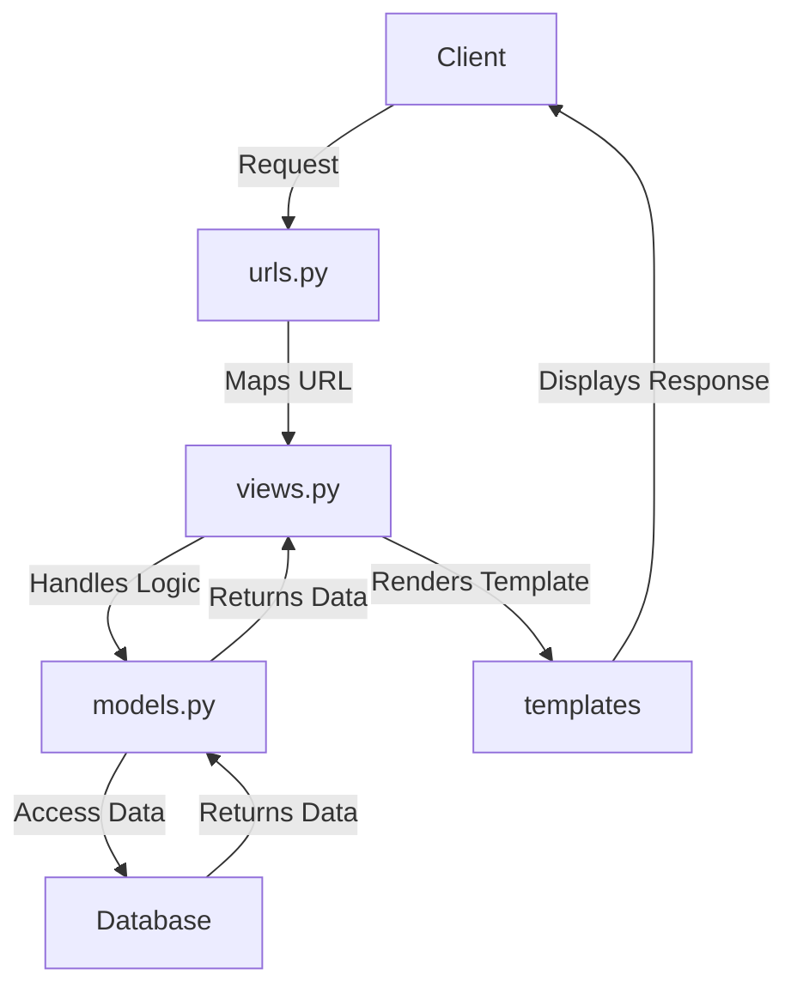

# README - PacilBay

## *Link* Aplikasi yang Sudah Dideploy
[Aplikasi PacilBay](http://theo-ananda-pacilbay.pbp.cs.ui.ac.id/) (http://theo-ananda-pacilbay.pbp.cs.ui.ac.id/)

## Implementasi *Checklist*

  
<h2>Tugas 2: (Click to Expand)</h2>

### Langkah-langkah Implementasi Aplikasi Berbasis Django

1. **Menyiapkan *development environment*:**
   - Menginstal Python, Django, dan *dependencies* yang dibutuhkan.
   - Membuat *virtual environment* supaya aplikasi tidak bentrok dengan versi lain.

2. **Membuat Proyek Django:**
   - Menjalankan `django-admin startproject pacilbay` untuk membuat proyek baru.
   - Menyesuaikan pengaturan di `settings.py`, seperti konfigurasi *database*, `INSTALLED_APPS`, *allowed host* untuk mengizinkan `localhost` dan PWS mengakses aplikasi.

3. **Membuat Aplikasi Django:**
   - Menjalankan `python manage.py startapp main` untuk membuat aplikasi `main` di dalam proyek.
   - Menambahkan aplikasi main ke dalam `INSTALLED_APPS` di `settings.py`.

4. **Membuat *Template* HTML:**
   - Membuat *HTML file* di folder `templates` untuk mengatur *view frontend*.
   - Menggunakan *template variables* untuk menampilkan nilai dari variabel yang akan dibuat di `views.py`.

5. **Membuat Model (`models.py`):**
   - Merancang model data dengan membuat *field* pada model di `models.py`.
   - Menjalankan perintah `python manage.py makemigrations` dan `python manage.py migrate` untuk merefleksikan perubahan model ke *database*.

6. **Membuat Views (`views.py`):**
   - Mengimpor fungsi render dari `django.shortcuts` dan menambhakan fungsi `show_main` yang berisi *dictionary* data untuk dikirimkan ke *HTML file*.
   - Menghubungkan views dengan *template HTML* yang akan dirender.

7. **Mengatur *URL Routing* (`urls.py`):**
   - Mengatur *routing URL* di `urls.py` untuk menambahkan *path* ke aplikasi main.
   - Memastikan setiap *view* memiliki *URL pattern* yang sesuai.

8. **Melakukan *Deployment*:**
    - Membuat proyek baru di *Pacil Web services* (PWS).
    - Mengonfigurasi `settings.py` untuk menambahkan *URL deployment* PWS ke `ALLOWED_HOSTS`.
    - Melakukan *add, commit*, dan *push* ke PWS.

### Bagan Request *Client* ke Web Aplikasi Django

**Penjelasan Bagan:**
    - `urls.py`: Menghubungkan URL yang diminta ke aplikasi dan data yang tersedia di views.py.
   - `views.py`: Menampung *template variables* untuk menampilkan nilai dari variabel yang sudah dibuat dalam `context`, dan akan di-*render* di halaman HTML.
   - `models.py`: Berisi model data dan menghubungkan ke *database*. `models.py` digunakan oleh `views.py` untuk mengambil dan mengolah data dari variabel yang sudah dibuat.
   - *Template* (HTML): Mengatur tampilan halaman web. *HTML file* akan di-*render* oleh `views.py` dan dikirim sebagai respons ke *client*.

### Fungsi **Git** dalam Pengembangan Perangkat Lunak
Git adalah *control version software* untuk mengelola dan melacak perubahan dalam *source code* selama pengembangan *software*. Fungsi utama git:

1. sebagai ***control version*** yang melacak setiap perubahan yang dibuat di dalam *source code* sehingga *developer* bisa kembali ke versi sebelumnya;
2. sebagai **sarana kolaborasi** karena memungkinkan beberapa *developer* bekerja di berbagai fitur atau memperbaiki bug tanpa mengganggu pekerjaan *developer* lain melalui *branch*.
3. sebagai ***development environment*** melalui *branching* dan *merging* sehingga *developer* bisa membuat cabang untuk pengembangan fitur atau *bug fixing* kemudian menggabungkannya ke *main branch* setelah dites.
4. menjaga **keamanan dan *backup*** karena bisa menyimpan *history* di *remote repository* seperti GitHub, GitLab, dll sehingga mengurangi risiko kode hilang.

### Alasan Menggunakan Django sebagai Framework Awal dalam Pembelajaran
1. **Framework Lengkap**
      Django adalah *full-stack framework* yang menyediakan semua yang dibutuhkan *developer* seperti *Object-Relational Mapping* (ORM), *template engine*, *form handling*, dan *routing*.
2. **Arsitektur MTV (Model-Template-View)**
      Arsitektur *Model-Template-View* (MTV) memudahkan *developer* memahami arsitektur aplikasi web.
3. **Keamanan Terjaga**
      Django menyediakan *middleware* yang otomatis melindungi aplikasi dari *Cross-Site Request Forgery* (CSRF) dan juga memiliki mekanisme untuk mencegah *Cross-Site Scripting* (XSS) dengan secara otomatis meng-*escape* output HTML.
4. **Community Support**
      Django memiliki komunitas yang besar dan dokumentasi yang lengkap sehingga *beginner friendly* :D

### Mengapa Model pada Django Disebut sebagai ORM?
Model pada Django disebut sebagai ORM (*Object-Relational Mapping*) karena terdapat *interface* antara model di Python (class) dengan *relational database* (tabel). Dengan prinsip ini, *developer* bisa bekerja menggunakan *database* dengan konsep *object-oriented* tanpa harus membuat query SQL manual. Django ORM mengubah operasi *Create, Read, Update, Delete* (CRUD) di OOP Python ke *query SQL* yang bersifat *connected* dengan *database*, sehingga memudahkan interaksi aplikasi dengan data.

  
<h2>Tugas 3: (Click to Expand)</h2>

### Langkah-langkah Implementasi Form dan Data Delivery pada Django
1. **Membuat Kerangka *Views* dengan Skeleton**
   Saya membuat kerangka *views* (skeleton) supaya desain web konsisten dan mengurangi *redundant code*. 
   - Buat direktori `templates` di folder utama, buat file `base.html` sebagai kerangka yang akan dipakai untuk semua halaman web di aplikasi-aplikasi lain.
   - Isi `base.html` dengan sintaks HTML dan *Django template tags* `` dan `` untuk bagian-bagian yang bisa diubah oleh *template* turunan di aplikasi-aplikasi lain.
   - Buka `settings.py`, tambahkan direktori `templates` (`'DIRS': [BASE_DIR / 'templates']`) ke dalam variabel `TEMPLATES` supaya *template* yg sudah dibuat dikenali Django.
2. **Mengubah *Primary Key* dari *Integer* Menjadi UUID**
   Untuk meningkatkan keamanan aplikasi, kita ubah *primary key* di model dari tipe data *integer* menjadi UUID (*Universally Unique Identifier*).
   - Pada `models.py` di aplikasi `main`, impor modul `uuid` dan ubah *primary key* menjadi UUIDField.
   - Menjalankan `makemigrations` dan `migrate` supaya perubahan yang kita lakukan disimpen di *database*.
3. **Membuat *Form Input Data***
   - Buat *file* `forms.py` di direktori main, dan buat `ModelForm` untuk model `ProductEntry`.
   - Buat *field* yang akan digunakan dalam *form* seperti `product_name`, `price`, `product_description`, dan `available_qty`.
   - Di `views.py`, buat fungsi `create_mood_entry` untuk menampilkan *form* dan menyimpan data baru saat *form* di-*submit* dan mereturn respons html ke *template* `create_product_entry`.
   - Validasi *form* menggunakan *function* `form.is_valid()` dan simpan data dengan *function* `form.save()`.
4. **Menampilkan Data di Halaman Web**
   - Ambil semua objek dari model `ProductEntry` dengan menambahkan *function* `ProductEntry.objects.all()` dan kirim ke *template* melalui *context* yang sudah dibuat sebelumnya. --> *function* ini akan di-*return* dengan html di *template* `main`.
   - Pada `main.html`, kita gunakan *looping* `` untuk menampilkan data dalam bentuk tabel. 
   - Pada `main.html`, kita tambahkan juga tombol untuk mengakses halaman *form input* data baru.
5. **Mengembalikan Data dalam Bentuk XML dan JSON (dan berdasarkan ID)**
   - Di `views.py`, buat fungsi `show_xml` untuk mengambil semua data dari model `MoodEntry`
   - Gunakan *serializers* Django untuk mengubah data menjadi format XML.
   - Buat juga buat versi jsonnya :)
   - Buat fungsi `show_xml_by_id` dan `show_json_by_id` di views.py untuk *mereturn* data berdasarkan id yang sudah difilter sebagai parameter. --> variabel data diubah dari *all* menjadi `ProductEntry.objects.filter(pk=id)`
6. **Menambahkan *URL Patterns***
   - Tambahkan *path* untuk setiap fungsi *view* baru di variabel `urlpatterns` supaya bisa diakses di browser.
   - Mengecek apakah data bisa diambil dengan benar menggunakan *postman* (screenshoot terlampir di bawah)
Setelah melalui 6 langkah ini, kita bisa membuat form, menyimpan data, menampilkan data, dan *mereturn* data dalam format XML atau JSON di Django

### Mengapa kita memerlukan data delivery dalam pengimplementasian sebuah *platform*?
- Memungkinkan kita berinteraksi secara *real time* dengan *platform*
   Dengan menggunakan *data delivery*, kita bisa mengisi *form*, mengklik tombol, dan melakukan *search*. Data yang di-*input* dalam kegiatan-kegiatan tersebut harus dikirim ke *server* untuk diproses melalui peran *data delivery*. Melalui *data delivery* ini, kita bisa membuat interaksi menjadi lebih interaktif dan dinamis.

- Memunkinkan kita menerima data yang terbaru
   *Data delivery* memastikan bahwa data yang kita terima di *platform* selalu yang terbaru. Data yang realtime sangat dibutuhkan untuk aplikasi berita, cuaca, harga saham, dll yang membutuhkan data real time.

Contoh:
Saat pengguna *login* ke *platform*, kredensial kita (misal *username* dan *password*) dikirim ke *server* untuk diverifikasi. Pengiriman tersebut membutuhkan *data delivery* pada *platform*. Tanpa *data delivery*, *user* tidak bisa melakukan *login* dan mengakses akun.

### mana yang lebih baik antara XML dan JSON?
JSON (*JavaScript Object Notation*) dan XML (*eXtensible Markup Language*) adalah format yang digunakan untuk pertukaran data antara *server* dan *client* dalam pengembangan aplikasi. Masing-masing memiliki kelebihan dan kekurangan, tapi JSON dianggap lebih baik daripada XML. Kenapa JSON lebih populer dibandingkan XML?

| Kriteria     | JSON     | XML |
|--------------|-----------|------------|
| Keterbacaan | JSON punya struktur yang lebih ringkas dan mudah dibaca manusia. JSON ditulis dalam format *key-value pairs* sehingga lebih mudah dipahami dan dikelola. | XML menggunakan *opening tag* dan *closing tag* untuk elemen datanya sehingga dokumennya lebih panjang dan lebih sulit dibaca. XML cenderung lebih *verbose* karena harus menggunakan banyak *markup* untuk menulis data.      |
| Ukuran data      | Karena JSON lebih ringkas, ukuran datanya juga lebih kecil dibanding XML. Karena lebih ringkas, lebih sedikit data yang harus dikirim melalui jaringan, sehingga dapat mengurangi waktu *loading* dan penggunaan *bandwidth*. | XML memiliki *overhead* yang lebih besar karena memerlukan *opening tag* dan *closing tag* untuk setiap elemen, yang dapat memperbesar ukuran *file*.        |
| *Compatibility* dengan JavaScript      | JSON adalah format yang berasal dari JavaScript, sehingga kompatibel dengan JavaScript. JSON dapat diubah menjadi objek JavaScript tanpa perlu *parser* lagi.   | XML membutuhkan *parser* untuk mengubah data menjadi objek JavaScript, sehingga lebih lambat dan kompleks.       |
| Keamanan      | JSON lebih aman terhadap serangan seperti *XML External Entity* (XXE) *attack* dibandingkan XML.   | XML lebih rentan terhadap berbagai jenis serangan karena kompleksitas dan fitur-fiturnya seperti DTD (*Document Type Definition*).        |

### Fungsi dari method is_valid() pada *form* Django
1. **Fungsi is_valid() pada Django Form**
   - Fungsi `is_valid()` memeriksa apakah data yang diterima dari *user* (melalui metode POST) memenuhi semua persyaratan yang sudah dibuat dalam form. Jika semua data valid, fungsi akan me-*return* nilai `True`. Jika ada data yang tidak valid, akan me-*return* `False`.
   - Fungsi `is_valid()` juga mengisi atribut `cleaned_data`. Ketika `is_valid()` bernilai `True`, Django akan membersihkan (*sanitize*) data *input* lalu me-*pass* ke dalam atribut `cleaned_data` pada objek *form*. 
   - Jika `is_valid()` mengembalikan `False`, Django akan mengisi atribut `errors` pada objek *form*. Atribut `errors` akan berisi informasi tentang kesalahan validasi yang terjadi pada setiap *field* di *form*.
2. **Mengapa Kita Membutuhkan *Method* is_valid()?**
   - `is_valid()` membantu kita menjaga integritas data karena sudah pasti semua semua data yang disimpan dalam sistem memenuhi persyaratan dan aturan validasi. --> ga mungkin ada data yang tidak lengkap atau formatnya salah.
   - `is_valid()` mencegah serangan keamanan seperti *SQL Injection* atau *Cross-Site Scripting* (XSS) dengan memastikan bahwa data *input* sudah disanitasi sebelum diproses atau disimpan dalam *database*.
   - Tanpa validasi `is_valid()`, data yang tidak valid bisa menyebabkan *error* di aplikasi. Misalnya *user* memasukkan *string* teks ke *field* yang seharusnya menerima *int*.

### Mengapa kita membutuhkan `csrf_token`?
`csrf_token` (*Cross-Site Request Forgery token*) adalah mekanisme keamanan saat ada *request form* dan HTTP POST *request*. Token ini melindungi aplikasi web dari serangan *Cross-Site Request Forgery* (CSRF) yaitu serangan di mana *attacker* memanipulasi *user* untuk mengirim *request* yang aneh-aneh tanpa diketahui *user*.
1. **Mengapa Kita Membutuhkan `csrf_token` saat Membuat *Form* di Django?**
   *CSRF attack* terjadi ketika *attacker* mensabotase *session* untuk melakukan *action* yang tidak diinginkan atas nama *user* tersebut (misalnya, mengubah *password*, melakukan transaksi keuangan, dll). `csrf_token` dihasilkan secara *random* dan unik, ditambahkan ke setiap *form* yang memerlukan POST (seperti *form* *login*, registrasi, dan *update* data). Sehingga, *attacker* tidak bisa mensabotase *session* tsb. Jika token CSRF tidak valid atau tidak ada, *request* tersebut dianggap mencurigakan dan akan ditolak oleh Django.

2. **Apa yang Dapat Terjadi Jika Kita Tidak Menambahkan `csrf_token` pada *Form* Django?**
   - *Attacker* bisa mengirim *request* berbahaya yang mengirimkan POST *request* ke aplikasi web tanpa sepengetahuan *user*. Jika *user* telah masuk ke aplikasi tersebut, *session* akan digunakan untuk mengautentikasi *request* tersebut.
   - Dengan menggunakan sesi tersebut, *attacker* bisa memanipulasi data, melakukan transaksi, menghapus akun, atau melakukan tindakan lain yang berdampak pada *user* atau sistem.
   - CSRF *attack* dapat mengakibatkan hilangnya data *user*, membocorkan informasi sensitif, dll.
3. **Bagaimana hal tersebut dapat dimanfaatkan oleh *attacker*?**
   - *Attacker* bisa membuat web palsu/email *phishing* yang mengandung *form* HTML atau link berbahaya. Saat *user* masuk ke aplikasi atau mengklik *link* atau mengirim *form*, POST *request* akan dikirim ke *server* menggunakan sesi *user* tersebut.
   - Dengan menggunakan JavaScript atau *hidden element*, *attacker* bisa mengirim data secara otomatis ke aplikasi web target saat *user* reload *webpage* atau melakukan tindakan tertentu (seperti mengklik tombol).
   - Karena permintaan datang dari sesi *user* yang sah, *server* akan mempercayai permintaan tersebut dan menganggap bahwa itu berasal dari *user* yang sah.

### Mengakses keempat URL di poin 2 menggunakan Postman

