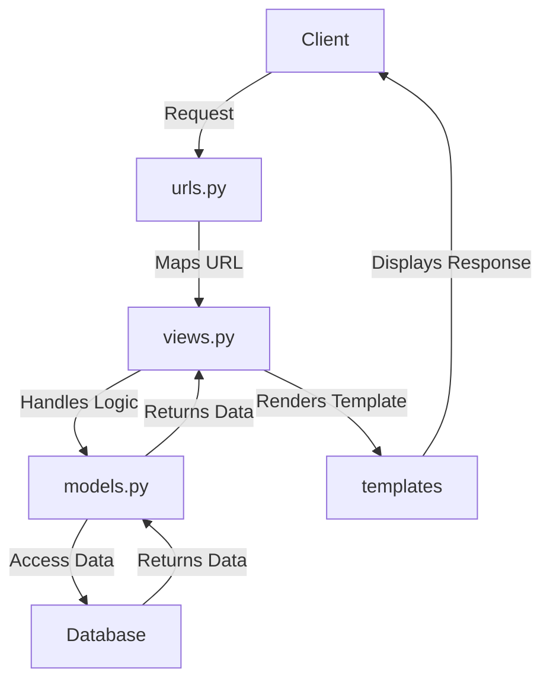

# README - PacilBay

## *Link* Aplikasi yang Sudah Dideploy
[Aplikasi PacilBay](http://theo-ananda-pacilbay.pbp.cs.ui.ac.id/) (http://theo-ananda-pacilbay.pbp.cs.ui.ac.id/)

## Implementasi *Checklist*

### Langkah-langkah Implementasi Aplikasi Berbasis Django

1. **Menyiapkan *development environment*:**
   - Menginstal Python, Django, dan *dependencies* yang dibutuhkan.
   - Membuat *virtual environment* supaya aplikasi tidak bentrok dengan versi lain.

2. **Membuat Proyek Django:**
   - Menjalankan `django-admin startproject pacilbay` untuk membuat proyek baru.
   - Menyesuaikan pengaturan di `settings.py`, seperti konfigurasi *database*, `INSTALLED_APPS`, *allowed host* untuk mengizinkan `localhost` dan PWS mengakses aplikasi.

3. **Membuat Aplikasi Django:**
   - Menjalankan `python manage.py startapp main` untuk membuat aplikasi `main` di dalam proyek.
   - Menambahkan aplikasi main ke dalam `INSTALLED_APPS` di `settings.py`.

4. **Membuat *Template* HTML:**
   - Membuat *HTML file* di folder `templates` untuk mengatur *view frontend*.
   - Menggunakan *template variables* untuk menampilkan nilai dari variabel yang akan dibuat di `views.py`.

5. **Membuat Model (`models.py`):**
   - Merancang model data dengan membuat *field* pada model di `models.py`.
   - Menjalankan perintah `python manage.py makemigrations` dan `python manage.py migrate` untuk merefleksikan perubahan model ke *database*.

6. **Membuat Views (`views.py`):**
   - Mengimpor fungsi render dari `django.shortcuts` dan menambhakan fungsi `show_main` yang berisi *dictionary* data untuk dikirimkan ke *HTML file*.
   - Menghubungkan views dengan *template HTML* yang akan dirender.

7. **Mengatur *URL Routing* (`urls.py`):**
   - Mengatur *routing URL* di `urls.py` untuk menambahkan *path* ke aplikasi main.
   - Memastikan setiap *view* memiliki *URL pattern* yang sesuai.

8. **Melakukan *Deployment*:**
    - Membuat proyek baru di *Pacil Web services* (PWS).
    - Mengonfigurasi `settings.py` untuk menambahkan *URL deployment* PWS ke `ALLOWED_HOSTS`.
    - Melakukan *add, commit*, dan *push* ke PWS.

### Bagan Request Client ke Web Aplikasi Django

**Penjelasan Bagan:**
    - `urls.py`: Menghubungkan URL yang diminta ke aplikasi dan data yang tersedia di views.py.
   - `views.py`: Menampung *template variables* untuk menampilkan nilai dari variabel yang sudah dibuat dalam `context`, dan akan di-*render* di halaman HTML.
   - `models.py`: Berisi model data dan menghubungkan ke *database*. `models.py` digunakan oleh `views.py` untuk mengambil dan mengolah data dari variabel yang sudah dibuat.
   - *Template* (HTML): Mengatur tampilan halaman web. *HTML file* akan di-*render* oleh `views.py` dan dikirim sebagai respons ke *client*.

### Fungsi **Git** dalam Pengembangan Perangkat Lunak
Git adalah *control version software* untuk mengelola dan melacak perubahan dalam *source code* selama pengembangan *software*. Fungsi utama git:

1. sebagai ***control version*** yang melacak setiap perubahan yang dibuat di dalam *source code* sehingga *developer* bisa kembali ke versi sebelumnya;
2. sebagai **sarana kolaborasi** karena memungkinkan beberapa *developer* bekerja di berbagai fitur atau memperbaiki bug tanpa mengganggu pekerjaan *developer* lain melalui *branch*.
3. sebagai ***development environment*** melalui *branching* dan *merging* sehingga *developer* bisa membuat cabang untuk pengembangan fitur atau *bug fixing* kemudian menggabungkannya ke *main branch* setelah dites.
4. menjaga **keamanan dan *backup*** karena bisa menyimpan *history* di *remote repository* seperti GitHub, GitLab, dll sehingga mengurangi risiko kode hilang.

### Alasan Menggunakan Django sebagai Framework Awal dalam Pembelajaran
1. **Framework Lengkap**
      Django adalah *full-stack framework* yang menyediakan semua yang dibutuhkan *developer* seperti *Object-Relational Mapping* (ORM), *template engine*, *form handling*, dan *routing*.
2. **Arsitektur MVC (Model-View-Control)**
      Arsitektur *Model-View-Control* (MVS) memudahkan *developer* memahami arsitektur aplikasi web.
3. **Keamanan Terjaga**
      Django menyediakan *middleware* yang otomatis melindungi aplikasi dari *Cross-Site Request Forgery* (CSRF) dan juga memiliki mekanisme untuk mencegah *Cross-Site Scripting* (XSS) dengan secara otomatis meng-*escape* output HTML.
4. **Community Support**
      Django memiliki komunitas yang besar dan dokumentasi yang lengkap sehingga *beginner friendly* :D

### Mengapa Model pada Django Disebut sebagai ORM?
Model pada Django disebut sebagai ORM (*Object-Relational Mapping*) karena terdapat *interface* antara model di Python (class) dengan *relational database* (tabel). Dengan prinsip ini, *developer* bisa bekerja menggunakan *database* dengan konsep *object-oriented* tanpa harus membuat query SQL manual. Django ORM mengubah operasi *Create, Read, Update, Delete* (CRUD) di OOP Python ke *query SQL* yang bersifat *connected* dengan *database*, sehingga memudahkan interaksi aplikasi dengan data.

